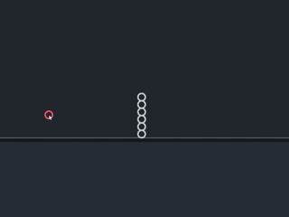

# Collision System :shield:

So the creature exists. It moves around. And then it promptly clips through walls and walks right through others like a ghost. Not really ideal... This is everything that stops that from happening!

## 1. Boundary Collision

The playground exposes an `inner_min` and `inner_max` bounds, these are the usable bounds after accounting for borders and margins.  
For each node, we clamp it so it can't escape past those walls, accounting for its radius:

$$x_{clamped} = clamp(x,\; inner\_min.x + r,\; inner\_max.x - r)$$
$$y_{clamped} = clamp(y,\; inner\_min.y + r,\; inner\_max.y - r)$$

So far so easy. But if we just teleport the node to the wall, the implicit Verlet velocity still carries it through on the next frame. We need to reflect it.

### The Verlet Bounce

Remember how Verlet integration stores velocity implicitly as $x_t - x_{t-1}$? When a node hits a wall, we flip the relevant velocity component and apply damping:

$$v_{new} = -v_{old} \times damping$$

In practice, we update `prev_position` (not `position`) to encode that new velocity. There's also an `impact_damping` value on the Playground itself, and a per-node `collision_damping` for the node-node collision case!

```
new_prev_position = position + velocity * damping
```

This makes the bounce feel physical — fast nodes bounce harder, slow nodes gently tap the wall and stop.

<p align="center">
  
</p>

## 2. Node–Node Collision

<p align="center">
  
</p>

For two overlapping circles $A$ and $B$:

1. Compute the vector between them:

$$\vec{\delta} = P_A - P_B$$

2. Compute the actual distance:

$$dist = |\vec{\delta}|$$

3. Determine the minimum allowed distance (sum of radii):

$$min\_dist = r_A + r_B$$

4. If they overlap ($dist < min\_dist$), compute the overlap:

$$overlap = min\_dist - dist$$

5. Push them apart equally along the separation direction:

$$P_A = P_A + \hat{\delta} \times 0.5 \times overlap$$
$$P_B = P_B - \hat{\delta} \times 0.5 \times overlap$$

Each node gets moved halfway. The $0.5$ split assumes equal mass, which is fine for our purposes. 

> [!NOTE]
> Limb nodes are excluded from this entirely since they are managed by the FABRIK solver.

## 3. The Spatial Hash Grid

Checking every node against every other node is $O(n^2)$. With a handful of nodes that's fine. With hundreds? Not so much.

The world is divided into a grid of cells, each `CELL_SIZE` × `CELL_SIZE` pixels. Each node registers in every cell it overlaps.

```
min_cell_x = floor((x - r) / CELL_SIZE)
max_cell_x = floor((x + r) / CELL_SIZE)
min_cell_y = floor((y - r) / CELL_SIZE)
max_cell_y = floor((y + r) / CELL_SIZE)
```

Each overlapping cell gets a `CellEntry`:

```rust
struct CellEntry {
    cell_x: i32,
    cell_y: i32,
    collider_index: usize,
}
```

These entries are then **sorted**. Once sorted, all entries belonging to the same cell are contiguous in the list. We sweep through, and for each group of entries sharing a cell, we generate candidate pairs. This gives us only `O(n)` candidate pairs on average.

We store the pairs in a `HashSet<(usize, usize)>` (always ordered as `min, max`) so we don't check the same pair twice even if they share multiple cells.

## 4. Group Awareness

Nodes that belong to the same creature (the same *constraint group*) shouldn't collide with each other. That would make the spine fight itself, which is wrong (duh).  

> [!NOTE]
> In 2D, a creature *can* technically sit on top of itself.

The `ConstraintGraph` assigns every connected set of nodes a shared `group_id`. During collision resolution, if both nodes share the same group, we skip them:

```rust
if let (Some(g1), Some(g2)) = (col_a.group, col_b.group) {
    if g1 == g2 { continue; }
}
```

Cross-creature collisions still happen normally though. So two creatures bumping into each other will push apart as expected.

## 5. The Resolution Loop

We don't just resolve collisions once. One pass might fix pair $A$–$B$ but shift $A$ into pair $A$–$C$. So we iterate:

```
for _ in 0..4 {
    resolve all pairs
    if nothing moved, break early
}
```

`4` iterations is a sweet spot that balances performance and consistent collision resolution.


## 6. Wander Steering (Lookahead Avoidance)

Beyond hard collision resolution, Anchor nodes in `Procedural` mode have a softer, lookahead-based steering system to *proactively* avoid crashing into walls or other nodes before it happens. Think of it as the creature having peripheral vision.

### How It Works

At each frame, we cast several *scan points* ahead of the node's current wander direction at multiple distances:

$$scan\_point_i = position + \hat{direction} \times scan\_dist_i$$

Scan distances range from close (`radius × 1.5`) all the way out to far lookahead (`amplitude + speed × 1.5`). This gives the node a layered awareness, it reacts strongly to nearby threats and gently to distant ones.

For each scan point, we calculate a **steering signal**, a scalar angle correction. The signal pushes the wander direction away from the threat:

$$steering += angle\_diff(away\_direction, current\_angle) \times strength \times urgency$$

Where:

$$urgency = 1.0 - \frac{dist}{min\_safe\_distance}$$

So closer = stronger reaction.

All steering contributions are summed, clamped to $[-\pi, \pi]$, and applied smoothly using `STEERING_RESPONSIVENESS × dt`.

### Boundary Steering

The same scan-and-steer logic is applied to walls. As a scan point approaches a boundary, it generates a repulsive steering correction pointing the wander direction back toward the interior. The repulsion is weighted quadratically, getting close to a wall causes a sharp increase in urgency:

$$weight = \left(1.0 - \frac{dist}{BOUNDARY\_AVOIDANCE\_RANGE}\right)^2$$

A constant `HORIZONTAL_WANDER_BIAS` also gently nudges the creature's wandering tendency toward horizontal movement, since vertical-heavy wandering tends to look less natural.

### Stuck Detection

If a node's wander target gets too close to its current position ($dist < STUCK\_DETECTION\_THRESHOLD$), it assumes it's stuck and rotates its wander direction by `STUCK_TURN_SPEED × dt` to escape... hopefully.

### Corner Case

If the wander target leaves both axes at once (i.e., it's trying to move into a corner), we don't just reflect one axis, instead, we compute a direction toward the center of the playground and steer toward that:

$$center\_dir = normalize(center - position)$$
$$wander\_direction = steer\_smoothly(wander\_direction, center\_angle, STUCK\_TURN\_SPEED \times 2 \times dt)$$

This prevents the node from bouncing endlessly between two walls.

### Target Smoothing

The final target position isn't applied raw. It's lerped toward the new value each frame:

$$target_{new} = lerp(target_{prev}, raw\_target, TARGET\_SMOOTHING)$$

This makes the movement feel much more fluid and organic rather than snapping to the computed target.

## 7. The Pipeline

Putting it all together, here's the order everything runs per frame:

| Step | System | What It Does |
|------|--------|-------------|
| 1 | `verlet_integration_system` | Moves Normal nodes via Verlet |
| 2 | `anchor_movement_system` | Moves Anchor nodes toward their targets |
| 3 | `constraint_solving_system` | Enforces distance + angle constraints |
| 4 | `collision_avoidance_system` | Boundary clamping → spatial hash → push-apart |

Collision avoidance runs last so it's the final word on where nodes end up. Constraints can nudge nodes around all they like, but if a node ends up in a wall, collision gets to override that.
