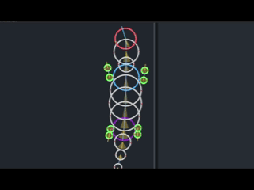

# Limbs & Inverse Kinematics :mechanical_arm:

Most creatures have limbs, thus it was essential to be added to the engine. Limbs are what make things look alive! They need their own dedicated solver because regular Verlet + distance constraints aren't enough. Enter **FABRIK**: *Forward And Backward Reaching Inverse Kinematics*.

> [!NOTE] Limb nodes are completely excluded from Verlet integration and node–node collision. Their positions are owned entirely by the FABRIK solver every frame.

## 1. What Is Inverse Kinematics?

Regular (forward) kinematics starts at the root and places each joint relative to the previous one. Simple, but it can't answer the question *"where do I need to bend so my hand reaches that point?"*

**Inverse Kinematics** works backwards: given a **target** position for the end of the chain (the tip / foot), figure out where every joint in between should be.

There are many IK algorithms out there. We use FABRIK because it:
- Works naturally with angle constraints
- Is iterative and easy to tune
- Handles arbitrary chain lengths without matrix math
- My source of inspiration used it :)

## 2. The FABRIK Algorithm

Each limb is a chain of joints. The chain starts at the **body node** (the shoulder or hip) and ends at the **tip** (the foot, hand, etc.).

<p align="center">
  
</p>

Each frame, we run up to `iterations` passes of the FABRIK two-step:

### Backward Pass (Reach toward target)

Starting at the **tip** and working back toward the root:

1. Snap the tip to the target.
2. For each joint going backwards, pull it toward the next joint while maintaining the segment length $L_i$:

$$P_i = P_{i+1} + \hat{(P_i - P_{i+1})} \times L_i$$

After this pass, the tip is on the target, but the root has drifted away from the body.

### Forward Pass (Re-root back to body)

Starting at the **root** (body position) and working forward toward the tip:

1. Fix the root back to the body node's position.
2. For each joint going forward, push it away from the previous joint while maintaining segment length, then apply the **angle constraint**:

$$raw\_angle = atan2(P_{i+1} - P_i)$$
$$constrained\_angle = clamp(raw\_angle, prev\_angle + angle\_min, prev\_angle + angle\_max)$$
$$P_{i+1} = P_i + \text{Vector}(constrained\_angle) \times L_i$$

This is repeated until either the tip is within `tolerance` of the target, or we've hit the `iterations` limit.

### Stretch Fallback

What if the target is farther away than the total limb length?

$$total\_length = \sum L_i$$

If $dist(target, root) \geq total\_length$, there's no valid bent configuration. Instead of running the full FABRIK loop, we just stretch the chain straight toward the target:

$$P_{i+1} = P_i + \hat{(target - root)} \times L_i$$

---

## 3. Bend Control

FABRIK on its own doesn't know which *side* to bend. A knee could bend forward or backward and both are geometrically valid. We control this with a `Vec<bool>`.

The check uses the **cross product** of the root -> tip axis and the root -> joint vector:

$$cross = (tip - root) \times (joint - root)$$

- If `cross.signum()` matches the desired side, the joint is on the right side — leave it.
- If not, reflect it across the root -> tip axis:

$$joint_{reflected} = projection - perpendicular$$

Where `projection` is the point on the root -> tip line closest to the joint, and `perpendicular` is the vector from there to the joint. Flipping that perpendicular puts the joint on the opposite side.

This runs once per forward pass iteration over all interior joints.

## 4. The Stepping System

A real leg doesn't slide continuously; it **plants, then steps**. If we just let the IK target follow the body directly, the foot would glide in place. That looks wrong.

The stepping system gives each limb a planted `target` position that only updates when the body moves far enough away from it.

### When to Step

Each frame we compute an `ideal_target` — where the foot *should* be based on the body's current position and direction. If the planted target is more than `step_threshold` away from the ideal target, we trigger a step:

```
if dist(target, ideal_target) > step_threshold:
    begin step from target → ideal_target
```

### The Step Arc

During a step, the foot doesn't teleport — it follows a smooth arc using **smoothstep** interpolation:

$$t_{smooth} = t^2 \times (3 - 2t)$$

The horizontal position is lerped along the floor:

$$flat\_pos = lerp(step\_start, step\_dest, t_{smooth})$$

And a vertical arc is added using a sine curve:

$$y_{offset} = \sin(t_{smooth} \times \pi) \times step\_height$$

This gives the foot a natural lift-and-plant motion. The `step_speed` controls how fast the step completes.

### Mid-Step Correction

If the body moves significantly during a step (i.e. the ideal target drifts more than `step_threshold × 0.5`), we update `step_dest` mid-flight so the foot plants somewhere sensible rather than landing at a now-outdated position.

## 5. Computing the Ideal Target

When no explicit `target_node` is set, the ideal target is computed automatically using the body node's `chain_angle` and the limb's `target_direction_offset`:

$$target\_angle = chain\_angle + target\_direction\_offset$$
$$ray\_end = body\_pos + \hat{target\_angle} \times max\_reach$$

We then ray-cast that ray against the playground's AABB. If the ray exits the playground before reaching `max_reach`, the target is clamped to the wall intersection. This is what keeps feet from trying to step outside the world.

If a `target_node` *is* set, we skip all of this and just use that node's position directly. Handy for limbs that need to grab or track something specific.
