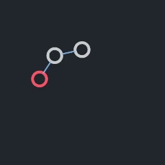
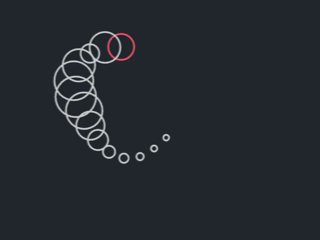

# Physics & Movement 🚀

This is where the magic happens! Making things move, stick together, while respecting physics ofcourse! or at least I hope it does I am not a physics expert :disguised_face:.

## 1. Verlet Integration

Normal approach would probably be something like this:
$$x_{t+1} = x_t + v_t$$
$$v_{t+1} = v_t + a_t$$

This is the standard Euler integration (slightly approximated). It is simple and fast, but it can be unstable especially when dealing with constraints, more on that later.

Then there is the Semi-Implicit Euler integration, which is:
$$x_{t+1} = x_t + v_{t+1}$$
$$v_{t+1} = v_t + a_t$$

We can simplify it to:
$$x_{t+1} = x_t + v_t + a_t$$
$$v_{t+1} = x_{t+1} - x_t \to v_t = x_t - x_{t-1}$$

Thus, we can finally write it as:
$$x_{t+1} = x_t + (x_t - x_{t-1}) + a_t$$

Congratulations! We now have Verlet integration!
It implicitly calculates velocity. It creates this really nice, heavy feel where momentum is preserved naturally.

## 2. Constraints

It represents the bones of the creature. Spines, legs, arms, etc.

Normal bones have some constraints. For example, a spine can't bend more than 45 degrees in any direction. Legs can't bend backwards, bones can't be longer or shorter, etc.

These constraints are divided into two categories:

### Distance Constraints
The 'edge' between nodes. This is what keeps the nodes at a specific distance from each other.

  

Imagine we have two nodes, $A$ and $B$, connected by a spring (or a bone).
We want the distance between them to be strictly equal to $L$ (Length).

1.  First we calculate the vector between them:
    $$\vec{d} = P_B - P_A$$

2.  Then we calculate the current distance:
    $$dist = |\vec{d}|$$

3.  We also calculate the normalized vector to know the direction for our correction:
    $$\hat{d} = \frac{\vec{d}}{dist}$$

4.  Now, get the difference from the wanted length:
    $$diff = dist - L$$

5.  Finally, we nudge them back together:
    $$P_A = P_A + \hat{d} \times 0.5 \times diff$$
    $$P_B = P_B - \hat{d} \times 0.5 \times diff$$

Notice the $0.5$? That's because we want to move *both* nodes equally to meet in the middle. If one node is an **Anchor** (infinite mass), we move the other one 100% of the way instead.

### Angle Constraints (Inverse Kinematics-ish)
To stop the creature from folding in on itself, I added angle constraints. This gives the creature that "spine-like" rigidity.

For every node in a chain, we look at its parent (previous node) and say:
*"Hey, you can't bend more than 45 degrees relative to me!"*

1.  We calculate the angle of the current segment.
2.  We compare it to the angle of the previous segment.
3.  If the difference is greater than our limit (e.g., $\frac{\pi}{4}$), we forcefully clamp it back.

$$
\theta_{clamped} = \text{clamp}(\theta_{current}, \theta_{parent} - limit, \theta_{parent} + limit)
$$

Then we reconstruct the node's position based on this new valid angle:
$$P_{new} = P_{parent} + \text{Vector}(\theta_{clamped}) \times L$$

This is effectively a simple Forward Kinematics pass that we run iteratively to keep the spine stiff but flexible.

  

And just like that, we have a spine that maintains its structural integrity while still allowing for natural, fluid movement!

### The Solver Loop
We run these calculations multiple times per frame (`CONSTRAINT_ITERATIONS`). The more iterations, the stiffer the constraints. It's a balance between performance and "jiggliness."

## 3. Legs Physics
TO BE ADDED (hope I finish the implementation to begin with lol)